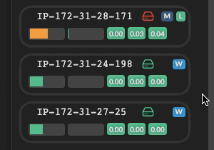

# Skep


## Overview

_Skep_ is a monitoring dashboard for [_Docker Swarm_](https://docs.docker.com/engine/swarm/):


You may find _Skep_ to be a useful addition to your toolbox along with projects like these:

* [SwarmProm](https://github.com/stefanprodan/swarmprom)
* [swarm-dashboard](https://github.com/charypar/swarm-dashboard)
* [docker-swarm-visualizer](https://github.com/dockersamples/docker-swarm-visualizer)

_Skep_ attempts to satisfy the following design objectives:

* Simple configuration and quick deployment
* Low resource footprint
* Reactive and clean user interface


## Configuration

An [example docker-compose.yml](docker-compose.yml) is provided.

The following environment variables are available on the `stats` service (i.e. the global agent):

| Variable | Meaning | Example |
|-|-|-|
| `SKEP_APP_URL` | URL that agent containers will use to send metrics to _Skep_ web application | `http://skep:8080/` _(default/recommended)_ |
| `DISKS` | Comma-separated list of disk devices to monitor (disk activity) | `sda,sdc` |
| `FILE_SYSTEMS` | Comma-separated list of file systems to monitor (available space) | `/hostfs/root,/hostfs/backups` (see [file systems](#file-systems)) |
| `NETWORK_INTERFACES` | Comma-separated list of network devices to monitor (traffic) **[not yet implemented]** | `eth0,eth3` |
| `LOG_LEVEL` | By default, the agent only logs initial configuration on launch and errors. Set to `DEBUG` to log all statistics. | `INFO` _(default/recommended)_ |

## Deployment

_Skep_ can be deployed just like any typical [https://docs.docker.com/engine/reference/commandline/stack_deploy/](stack):
```bash
docker stack deploy -c docker-compose.yml skep
```

<a name="file-systems"></a>
## File Systems

To monitor a file system it must be mounted into the agent as a [_Docker_ bind mount](https://docs.docker.com/storage/bind-mounts/). The `FILE_SYSTEMS` environment variable should refer to the **destination** of the bind mount.

For example, to monitor the root file system, the following configuration might be used:

```yaml
  stats:
    image: skep/stats

    volumes:
      - "/:/hostfs/root:ro"

    environment:
      FILE_SYSTEMS: '/hostfs/root'
```

## Architecture

_Skep_ is comprised of an agent which should be run globally and a web server which must have one replica.

The agent harvests system and container metrics which are sent to the web server and forwarded to the [_React_](https://reactjs.org/)-based front end.

The front end is read-only. No changes to a swarm can be made via the web application. A best-effort approach to filter sensitive data (e.g. passwords in environment configurations) is implemented using simple heuristics. Regardless, as with all similar systems, it is highly recommended that you run _Skep_ behind a firewall and/or an authentication layer.

## Features

### Expanded Stack View

View details of all tasks for each service including container metrics.


### Mount Configuration

Display all configured mount points for a given service.


### Environment Configuration

Display all configured environment variables for a given service.

_Values for keys containing "password", "key", etc. are replaced by asterisks._


### Related Nodes and Services Highlighting

Click any service to highlight:

* All services that share a network with the selected service
* All nodes that are running a task belonging to the selected service


### Node View

Expand the node view to see further details of a node including disk activity [**not shown in screenshot**], file system usage, etc.


### Flashing Lights

Enjoy looking at the flashing lights telling you that your nodes are alive and well.



## License

[MIT License](LICENSE)

## Contributing

Feel free to make a pull request.
