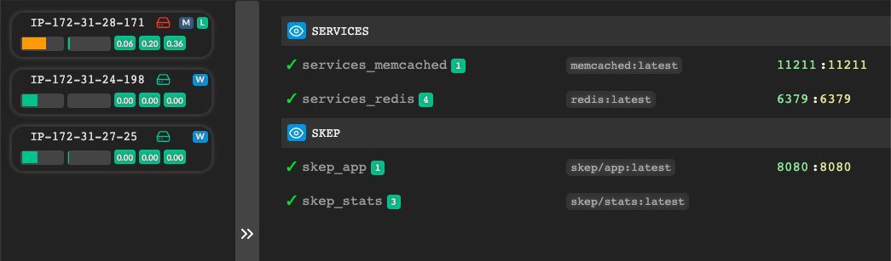
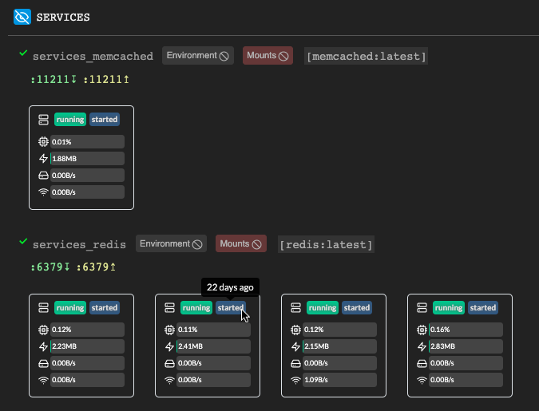
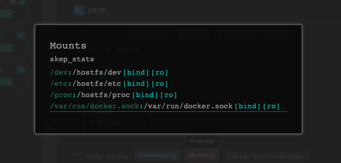
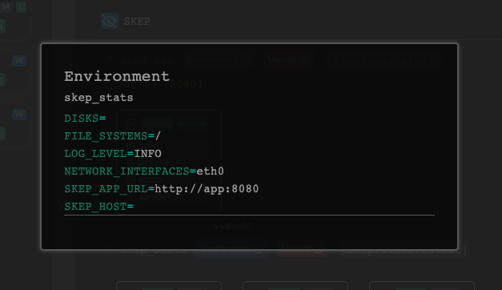
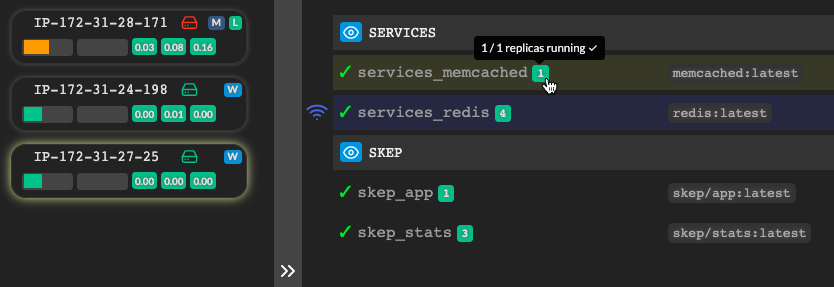
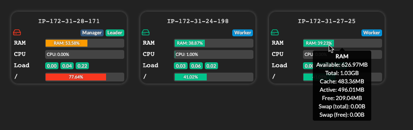
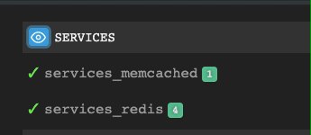

# Skep


## Overview

_Skep_ is a monitoring dashboard for [_Docker Swarm_](https://docs.docker.com/engine/swarm/):



You may find _Skep_ to be a useful addition to your toolbox along with projects like these:

* [SwarmProm](https://github.com/stefanprodan/swarmprom)
* [swarm-dashboard](https://github.com/charypar/swarm-dashboard)
* [docker-swarm-visualizer](https://github.com/dockersamples/docker-swarm-visualizer)
* [portainer.io](https://www.portainer.io/)
* [Consul](https://www.consul.io/)

_Skep_ attempts to satisfy the following design objectives:

* Simple configuration and quick deployment
* Low resource footprint
* Reactive and clean user interface

## Features

### Expanded Stack View

View details of all tasks for each service including container metrics.



### Mount Configuration

Display all configured mount points for a given service.



### Environment Configuration

Display all configured environment variables for a given service.

_Values for keys containing "password", "key", etc. are replaced by asterisks._



### Related Nodes and Services Highlighting

Click any service to highlight:

* All services that share a network with the selected service
* All nodes that are running a task belonging to the selected service



### Node View

Expand the node view to see further details of a node including disk activity [**not shown in screenshot**], file system usage, etc.



### Service Update Tracking

Monitor service updates to ensure deployments run cleanly:



### Flashing Lights

Enjoy looking at the flashing lights telling you that your nodes are alive and well.


## Configuration

An [example docker-compose.yml](docker-compose.yml) is provided.

The following environment variables are available:

### Front end web app

| Variable | Meaning | Example |
|-|-|-|
| `SKEP_SECRET` | Set this to an appropriately complex token to verify agent updates. It is **highly recommended** that you enable this feature. (The same value must be set for the _agent_ and _monitor_ services).  | `averylongandcomplexsecret` |

### Monitor

| `SKEP_SECRET` | If provided, will use to authenticate with front end web app when reporting statistics (the same value must be set for the web app service) | `averylongandcomplexsecret` |
| `SKEP_APP_URL` | URL that agent containers will use to send metrics to _Skep_ web application | `http://app:8080/` _(default/recommended)_ |
| `SERVICE_URL_TEMPLATE` | URL template for service names | See [URL templating](#url-templating) |
| `IMAGE_URL_TEMPLATE` | URL template for image names | See [URL templating](#url-templating) |
| `LOG_LEVEL` | By default, the monitor only logs initial configuration on launch and errors. Set to `DEBUG` to log all statistics. | `INFO` _(default/recommended)_ |
| `COLLECT_INTERVAL` | Time in seconds to wait between gathering metrics. | `5` |
| `SAMPLE_DURATION` | _Minimum_ time in seconds to monitor disk I/O etc. Will accumulate for multiple devices. | `10` |

### Agent

| Variable | Meaning | Example |
|-|-|-|
| `SKEP_APP_URL` | URL that agent containers will use to send metrics to _Skep_ web application | `http://app:8080/` _(default/recommended)_ |
| `SKEP_SECRET` | If provided, will use to authenticate with front end web app when reporting statistics (the same value must be set for the web app service) | `averylongandcomplexsecret` |
| `DISKS` | Comma-separated list of disk devices to monitor (disk activity) | `sda,sdc` |
| `FILE_SYSTEMS` | Comma-separated list of file systems to monitor (available space) | `/hostfs/root,/hostfs/backups` (see [file systems](#file-systems)) |
| `NETWORK_INTERFACES` | Comma-separated list of network devices to monitor (traffic) **[not yet implemented]** | `eth0,eth3` |
| `COLLECT_INTERVAL` | Time in seconds to wait between gathering metrics. | `5` |
| `SAMPLE_DURATION` | _Minimum_ time in seconds to monitor disk I/O etc. Will accumulate for multiple devices. | `10` |
| `LOG_LEVEL` | By default, the agent only logs initial configuration on launch and errors. Set to `DEBUG` to log all statistics. | `INFO` _(default/recommended)_ |
| `SKEP_HOST` | Set to `docker-desktop` when running on Docker Desktop for Mac | `docker-desktop` |

## Deployment

Deploy _Skep_ as a [Docker Stack](https://docs.docker.com/engine/reference/commandline/stack_deploy/):
```bash
docker stack deploy -c docker-compose.yml skep
```

<a name="file-systems"></a>
## File Systems

To monitor a file system it must be mounted into the agent as a [_Docker_ bind mount](https://docs.docker.com/storage/bind-mounts/). The `FILE_SYSTEMS` environment variable should refer to the **destination** of the bind mount. _Skep_ uses the base path `/hostfs` for mounting host file systems but any valid path is acceptable.

For example, to monitor the root file system, the following configuration might be used:

```yaml
  stats:
    image: skep/stats

    volumes:
      - "/:/hostfs/root:ro"

    environment:
      FILE_SYSTEMS: '/hostfs/root'
```

<a name="url-templating"></a>
## URL Templating

URL templating is supported for service names and image IDs. When the relevant environment variable is set, service names and image IDs will be rendered as hyperlinks according to a provided _Python_ format string. See the table below for available parameters:

### Service Name

| Parameter | Meaning | Example |
|-|-|-|
| `name` | Name of service | `skep_app` |
| `id` | Service ID | `yw1iaod282a7` |

### Image

| Parameter | Meaning | Example |
|-|-|-|
| `organization` | Image organization owner | `skep` |
| `repository` | Image repository name | `app` |
| `tag` | Image tag | `latest` |

### Example

```
# .env
SERVICE_URL_TEMPLATE=https://github.com/bobf/{name}
IMAGE_URL_TEMPLATE=https://hub.docker.com/r/{organization}/{repository}
```

## Architecture

_Skep_ is comprised of three services:

* An agent which is deployed globally (i.e. to all _Swarm_ nodes);
* A monitor which must be deployed to one manager node;
* A web app that can be deployed to any node but must also have only one replica.

See [docker-compose.yml](docker-compose.yml) for example configuration.

The agent periodically harvests system and container metrics which are sent to the web server and forwarded to the [_React_](https://reactjs.org/)-based front end.

Agents use bind mounts to access metrics from the host system (`/proc`, `/etc/`, and `/dev` are mounted). Agents also gather statistics about containers running on each host by mounting the `/var/run/docker.sock`.

The agent and monitor are written in _Python_ using the excellent [Docker SDK for Python](https://docker-py.readthedocs.io/en/stable/index.html).

The web application is also written in _Python_ using the equally excellent [Flask](http://flask.pocoo.org/) web framework and [Flask-SocketIO](https://flask-socketio.readthedocs.io/en/latest/).

The front end is read-only. No changes to a swarm can be made via the web application. A best-effort approach to filter sensitive data (e.g. passwords in environment configurations) is implemented using simple heuristics. Regardless, as with all similar systems, it is highly recommended that you run _Skep_ behind a firewall and/or an authentication layer.

## License

[MIT License](LICENSE)

## Contributing

Feel free to make a pull request.
